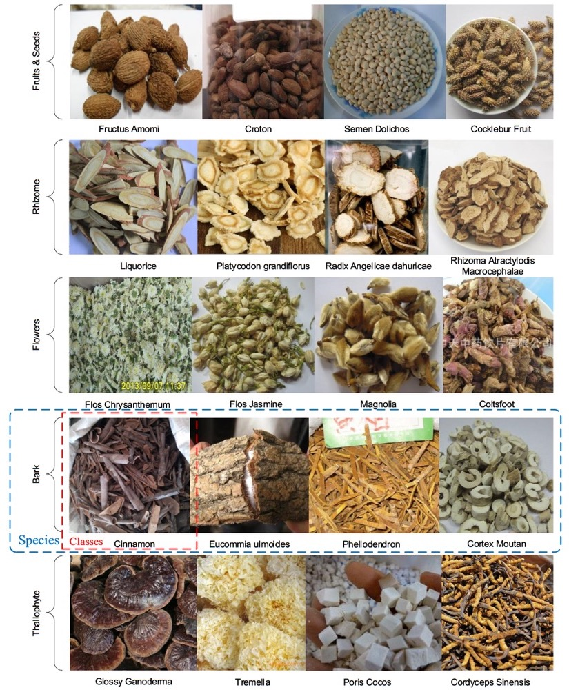
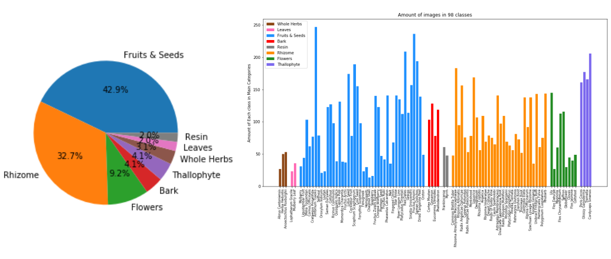

# Chinese Herbs Dataset

The Chinese-Herbs Dataset (CNH-98) is a collection of 9184 images of 98 classes, which can be divided into 8 categories including Fruits & Seeds, Rhizome, Flowers, Bark, Thallphyte, Whole Herbs, Leaves, Resin, whose examples are shown in the above figure.  

Here we exhibit a sample dataset of 20 classes, [Chinese-Herbs-98_Sample](./Chinese-Herbs-98_Sample/), and the folder name is **label name** of class.

If you need the CNH-98 dataset for non-commercial use, please contact us. (email: crghwen@scut.edu.cn)
## Distribution

The distribution of the number of Chinese herbs classes in the 8 categories (left) and images quantities between 98 classes (right) are shown : 

Main categories of CNH-98 dataset and their corresponding example name: 

| Main Categories | Herbs Examples                                               |
| --------------- | ------------------------------------------------------------ |
| Fruits & Seeds  | Star Anise, Siraitia Grosvenorii, Ginkgo, Chinese Wolfberry, SElfheal, Fructus Arctii, etc. |
| Rhizome         | Liquorice, Thorowax Root, Rhizoma Alismatis, Unibract Fritillary Bulb, etc. |
| Flowers         | Saffron, Flos Daturae, Cloves, Magnolia, Coltsfoot, Flos Jasmine, Lily, etc. |
| Bark            | Cinnamon, Cortex Moutan, Eucommia Ulmoides, etc.             |
| Thallophyte     | Glossy Ganoderma, Tremella, Cordyceps Sinensis, etc.         |
| Whole Herbs     | Abrus cantoniensis, Anoectochilus roxburghii, etc.           |
| Leaves          | Lophatherum Gracile, etc.                                    |
| Resin           | Frankincense, Myrrh, etc.                                    |

## Details of CNH-98

+ Source: Hospitals, Medicinal herbs stores,  [Google images](https://images.google.com/) and so on.
+ Quantities: 
  + 9184 images in total, 
  + 94 images on average for each class, 
  + 14 - 246 images per class
+ Classes: 98

- $32\times 32$
